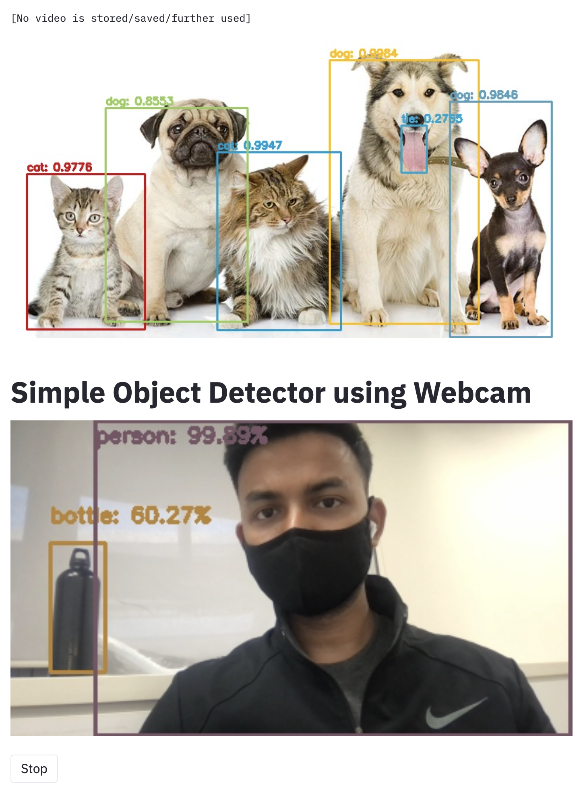

# Webcam-Object-Detector-Realtime
A light weight webapp for Object detection using Webcam

This WebApp has been tranined to detect ["background", "aeroplane", "bicycle", "bird", "boat", "bottle", "bus", "car", "cat", "chair", "cow", "diningtable", "dog", "horse", "motorbike", "person", "pottedplant", "sheep", "sofa", "train", "tvmonitor"]

[Notice --  This WebApp is now up and running on https://share.streamlit.io/siddharthksah/webcam-object-detector-realtime/main/main.py, It is still in the beta phase, please report bugs.]

Have fun! Happy browsing!

Below are instructions to implement in in your local system using a separate development environment using the [Conda](http://conda.pydata.org/docs/index.html) package management system which comes bundled with the Anaconda Python distribution provided by Continuum Analytics.

### Step 1:
[Fork and clone](https://github.com/siddharthksah/Webcam-Object-Detector-Realtime) a copy of this repository on to your local machine.

### Step 2:
Create a `conda` environment called `web-object-detector` and install all the necessary dependencies, the environment.yml file is uploaded in the repo for ease:

    $ conda env create -n web-object-detector python=3.8 -y
    
### Step 3:
Install the extra dependencies, it is not required but helps in making sure the jupyter notebook is running in the right conda env:

    $ pip install -r requirement.txt
    $ conda install nb_conda

### Step 4:
Activate the `web-object-detector' environment:

    $ source activate web-object-detector

To confirm that everything has installed correctly, type

    $ which pip

at the terminal prompt. You should see something like the following:

    $ ~/anaconda/envs/web-object-detector/bin/pip

which indicates that you are using the version of `pip` that is installed inside the `web-object-detector` Conda environment and not the system-wide version of `pip` that you would normally use to install Python packages.

### Step 5:
Change into your local copy of the this repo:

    $ cd Webcam-Object-Detector-Realtime

### Step 6:
Run the code:

    $ streamlit run main.py

